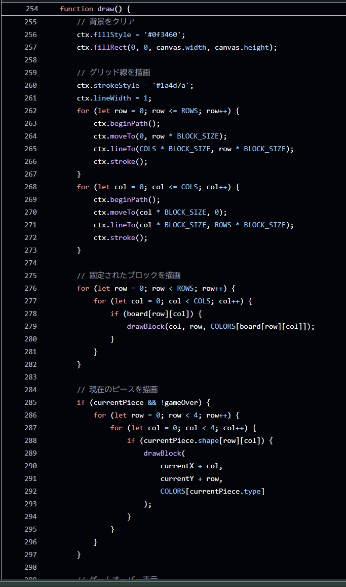
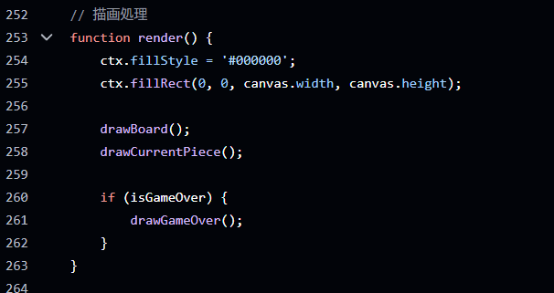

<!-- _class: lead -->
<!-- _header: "" -->
# Github Copilotはカスタマイズできる

---

## 最近、個人的にvscodeでGithub Copilotを使うことが多い
## そのままだと使いづらさを感じることがあった

- 頼んでない機能を追加する
- 一気に大量のコードを実装し始める
- ネストが深すぎて読みにくい
- マジックナンバーがある  etc

---

## ".instructions.md"を作成した

- AIへの指示をまとめたファイルのこと
- リポジトリ全体には`copilot-instructions.md`
- パス固有の指示は`.instructions.md`

```
my-app/
 └─ .github/
   ├─ copilot-instructions.md
   └─ instructions/
      ├─ frontend.instructions.md
      ├─ backend.instructions.md
      └─ tests.instructions.md
```

---

## どんなことを書くのか

- 作っているシステムの仕様
- それぞれのファイル、ディレクトリがどんなロジックを実装しているか
- コーディングルール etc

---

<!-- _class: lead -->
<!-- _header: "" -->


---

### こんな感じ指示を書いた

```
---
applyTo: "**"
---

(中略)

## コーディングルール（一部抜粋）

- 変数名・関数名は、目的が分かる名前にしてください。
- 関心事にふさわしい、より具体的で目的駆動の命名を使用してください。
- マジックナンバー／マジックストリングは避け、定数として定義してください。
- 定数は 大文字のスネークケース で命名してください。
- 目的ごとに関数を分割し、1 つの関数に複数の目的を持たせないでください。
- 早期リターンを用いて、ネストを浅くしてください。
- 不正値はガード節で排除してください。
```

---

## テトリスを作らせてみた(指示なし)



---

## テトリスを作らせてみた(指示あり)



---

## 実際に書いてみて

- 毎回指示しなくても一貫性のある綺麗な出力が出やすくなった
- トピックごとにファイルを書いておくと使いまわせて便利かも
- ほかのAIサービスでもカスタムできないか調べるようになった  etc
