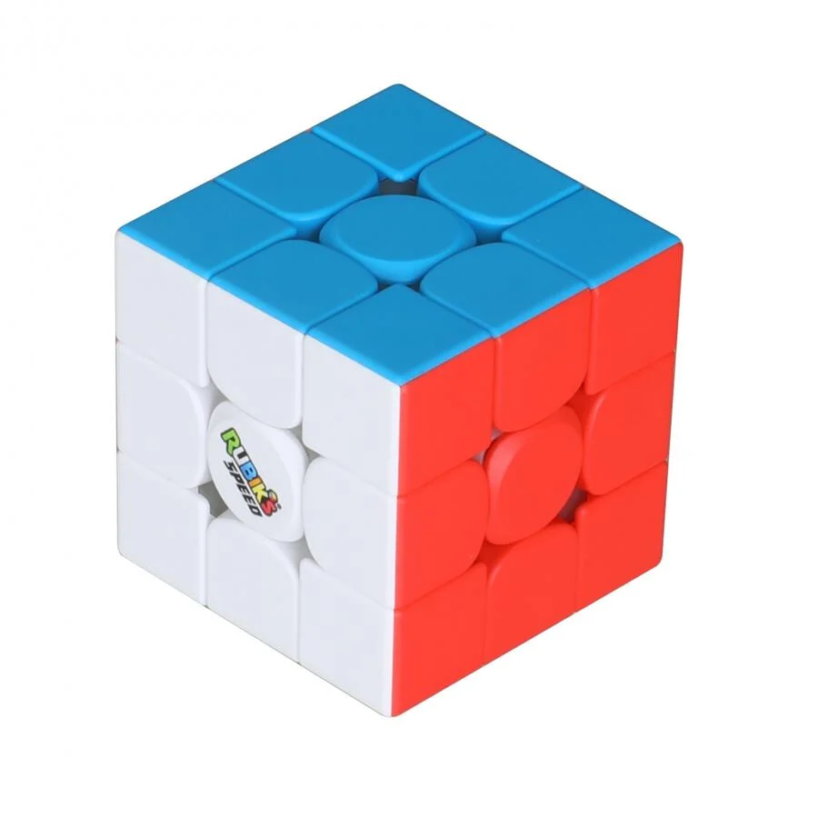
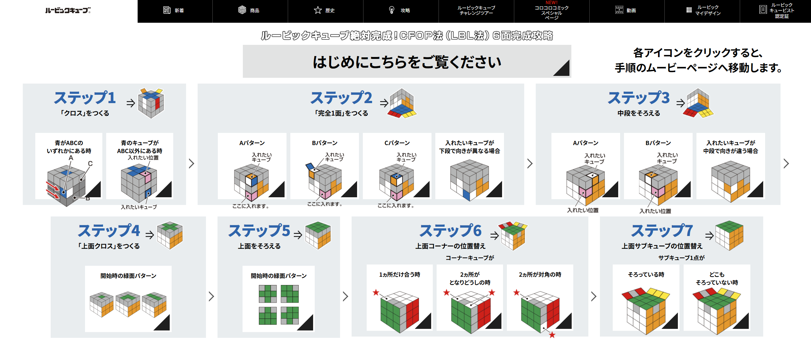
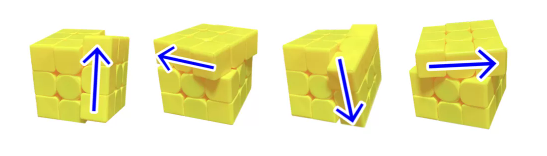
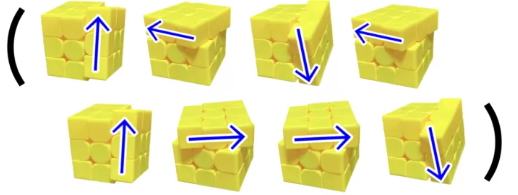
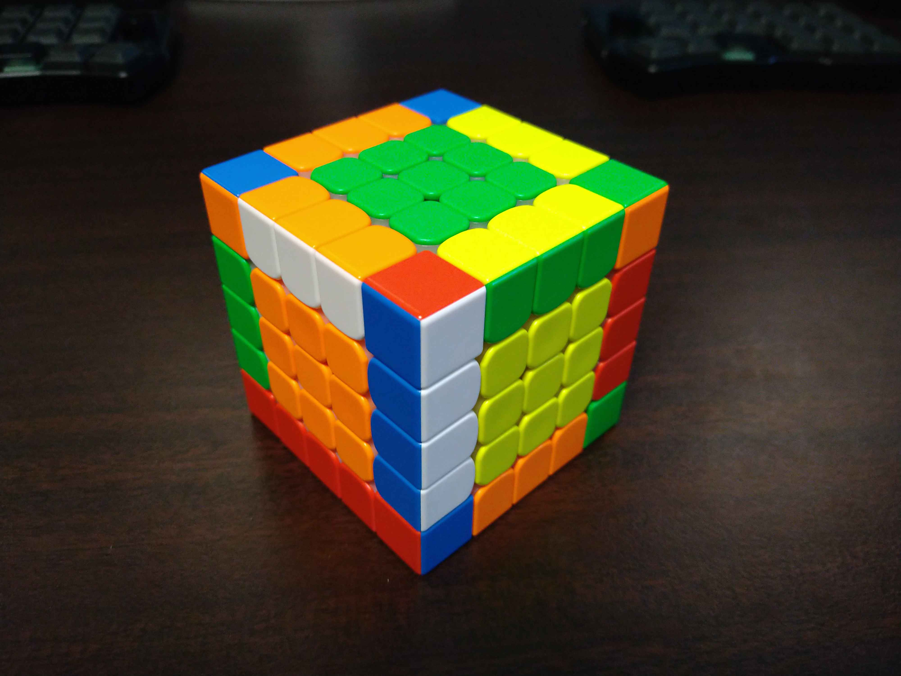
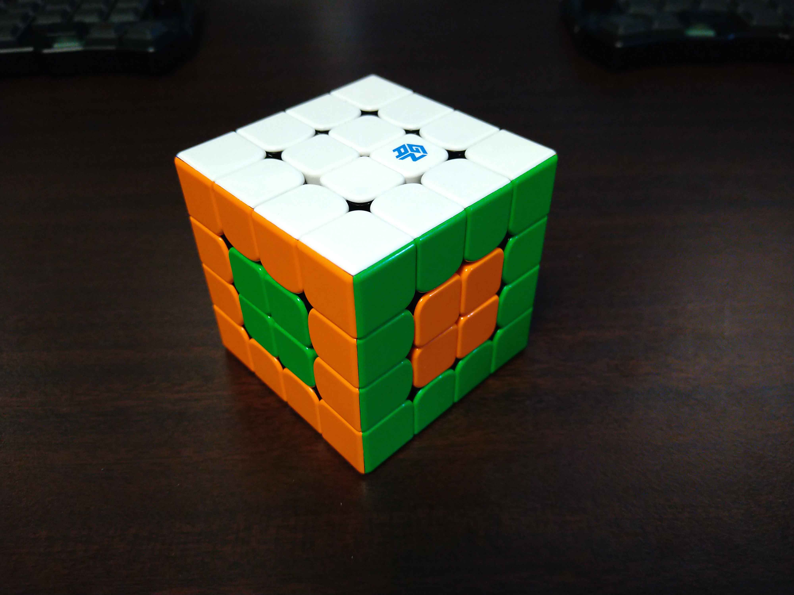
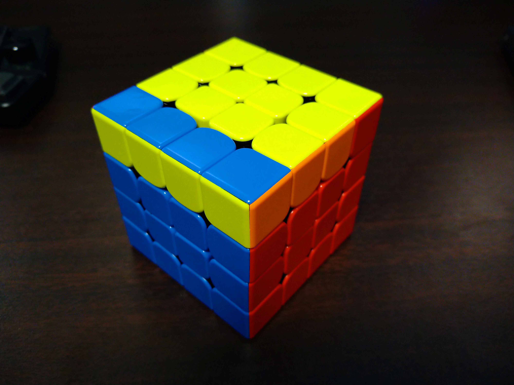
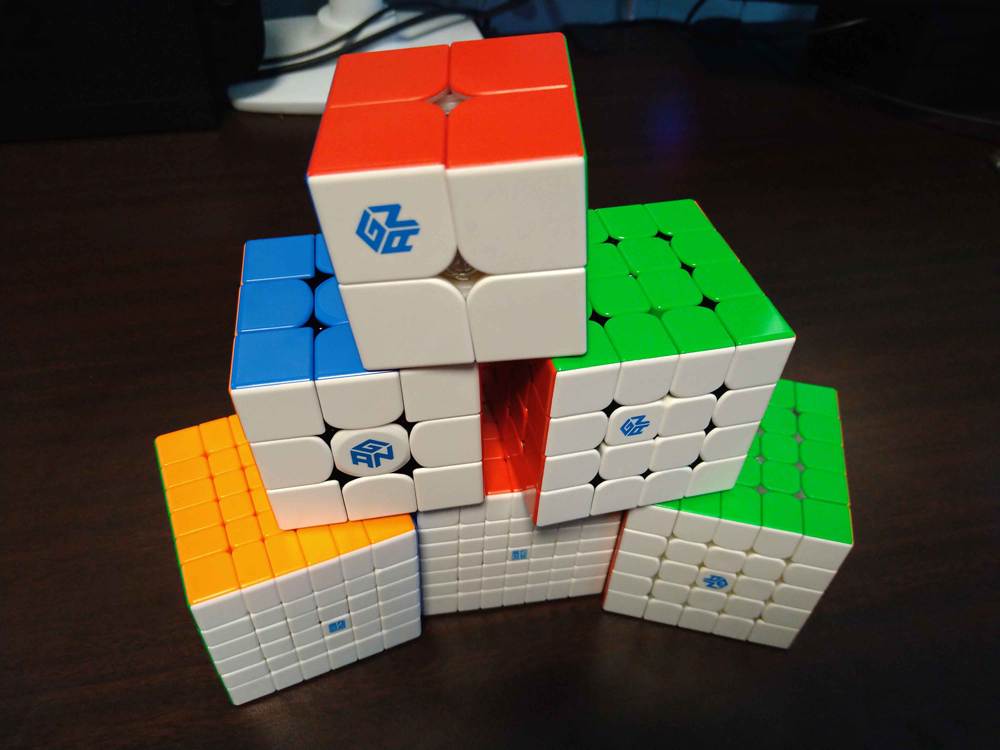

<!-- _class: lead -->
<!-- _header: "" -->
# ルービックキューブにハマっている

---

## Summary

- 2週間で**n×n×n**のキューブは全部解けるようになった
- 3×3×3の解き方＋αで全部解ける

---

## CFOP法 
自分が覚えた方法 (https://www.megahouse.co.jp/rubikcube/strategy/)

---

## 簡易CFOP法 
こっちの方が簡単 (https://www.daaokacubeblog.com/1696/)
さっきの7ステップの中で↓の回し方を多用する。基本セクシーのゴリ押し

セクシームーブ（逆順逆向きに回すと「逆セクシー」という）

スーン（逆順逆向きに回すと「アンチスーン」という）

---

## 4以上の解き方

前処理としてセンターとエッジをそろえる

- センターは結構簡単
- エッジはちょっと手数が多い

→ これで **奇数×奇数×奇数** は全部解ける

---

## 4以上の解き方(**偶数**の場合)

基本は同じ
ただ、めんどくさいことが起きる

- センターの色が分かりにくい
  - 真ん中のピースがないから

---

## 4以上の解き方(**偶数**の場合)

- センターとエッジをそろえても3×3×3の解き方で解けないパターンが存在する

→ このパターンを解消できる手順ができると **偶数×偶数×偶数** は全部解ける

---

## 実際、3～5を解けたらそれ以上も解けた

- 6×6×6、7×7×7はノーヒントで解けた

---

## いろいろ言ったけど、3×3×3だけでも結構面白い

