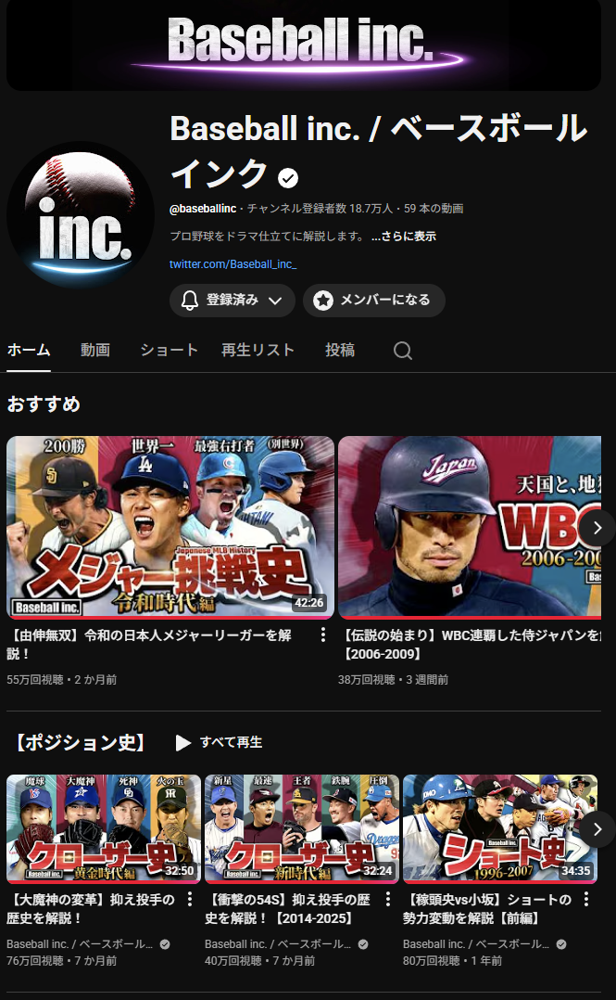
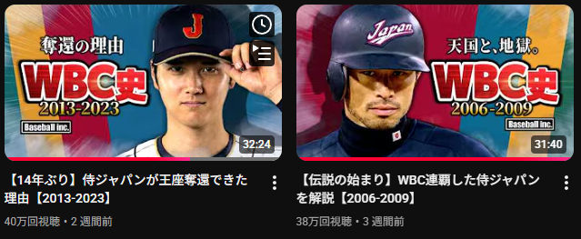
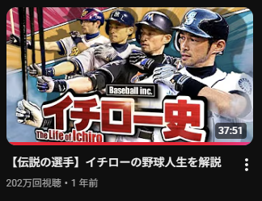

<!-- _class: lead -->
<!-- _header: "" -->
# 好きな野球系YoutubeCh

---

## Baseball inc.

- 平成～令和の野球界について解説
  - 野球界の歴史
  - 守備位置ごとの名選手解説
- めちゃくちゃ編集が丁寧
- きかんしゃトーマスのナレーションのみたいな落ち着いた声
- 30分前後のドラマ仕立ての長尺動画

---

## WBC

- 試合内容以外にも監督・選手の裏話も解説されている

---

## 一番好きな動画

keyword: 

    首位打者 - その年、最も打率が高かった打者
    打率 - 安打 ÷ 打数。3割を超えると一流の打者と言われる
