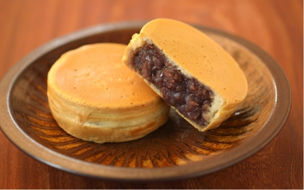
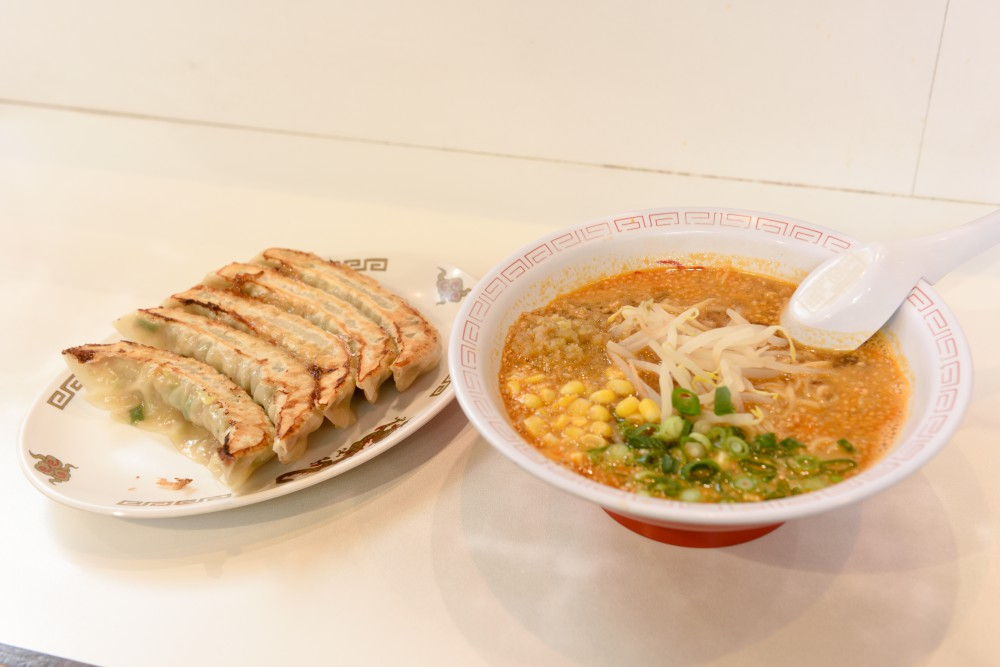
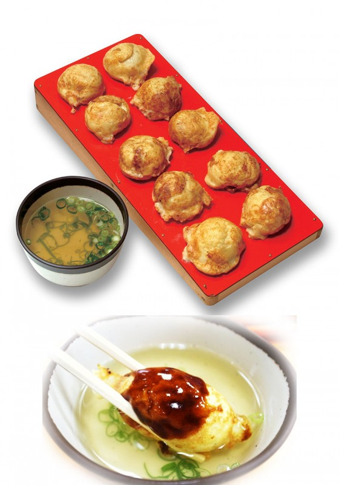

<!-- _class: lead -->
<!-- _header: "" -->
# 地元・姫路について①
# 帰った時によく食べるもの その１

---

## これなんて呼びますか？

- ネットで派閥戦争になるやつ
 

---

## これなんて呼びますか？

- ネットで派閥戦争になるやつ
 
→ 『**御座候**』ですね
→ 御座候 は姫路の企業

---

## 担々麺も作っている

- 担々麺（ゴマみそ）480円
- ジャンボ餃子 600円
- （値段上がった……。）
- 姫路市内のみ

---

## 明石焼き風たこ焼き

- 490円
- 明石市民に怒られる
  - 明石焼きじゃなくてたまご焼き
  - 明石のたまご焼きはソースをつけない

