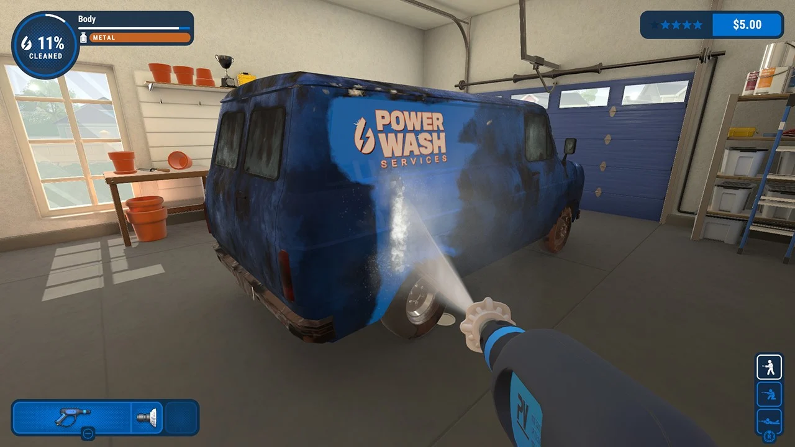
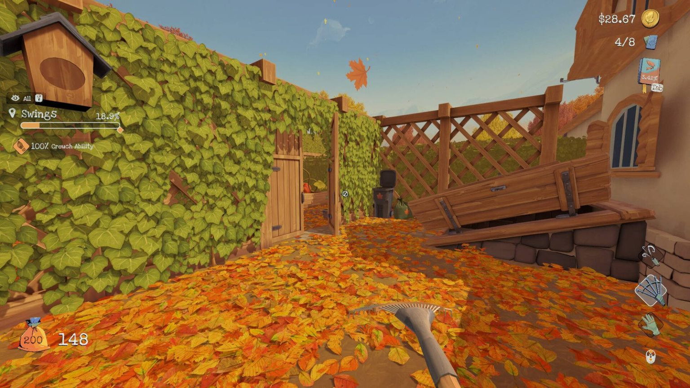
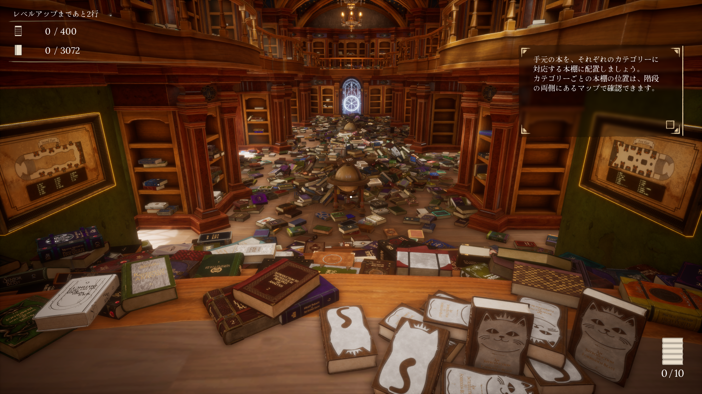
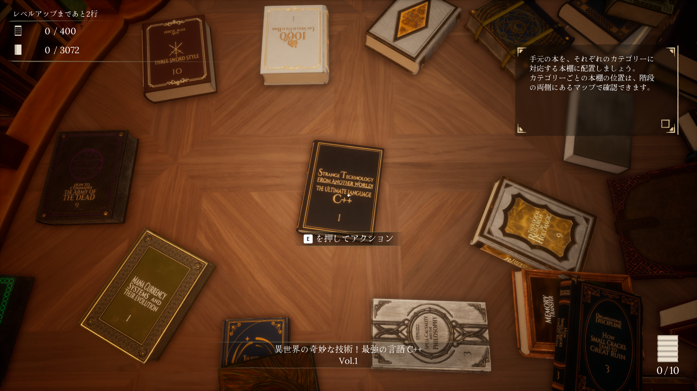
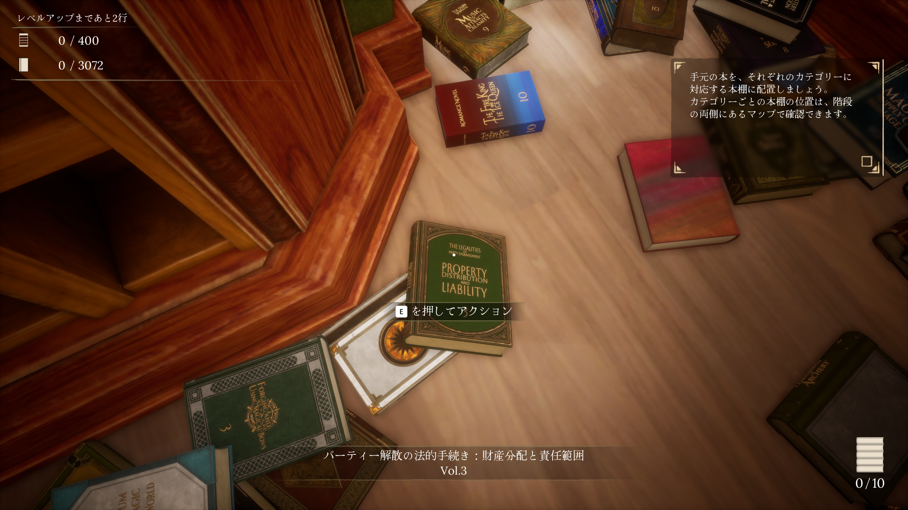
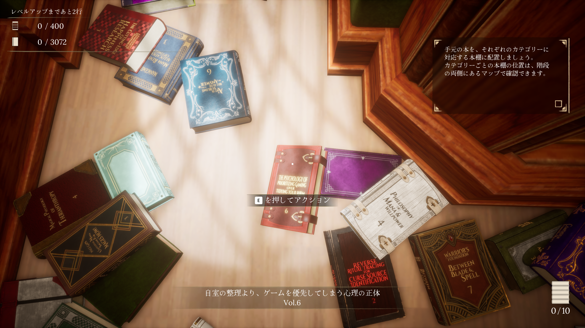

<!-- _class: lead -->
<!-- _header: "" -->

# お掃除作業系ゲーム

---

## どんなゲーム？（例外あるかも）

- 日常の掃除をゲーム内でやる
  - フィールドにあるオブジェクトの汚れを落とす
  - オブジェクトが散乱しているのを片付ける
- インフレ要素がある
  - プレイヤーの道具や能力が強化されてどんどん掃除が捗るようになる

---

## Q. なんでゲームで掃除するの？自分の家を掃除すれば？

### A. 

---

## Q. なんでゲームでやるの？自分の家を掃除すれば？

### A. それはそう(´;ω;｀)

- でも、便利になっていって作業が捗るのが楽しい

---

## 週末に遊んだゲーム

### Librarian: Tidy Up the Arcane Library
#### （邦題）司書のお仕事：魔導図書館を片付けろ！ 

- Youtubeで知った。700円
- 3000冊の魔導書などを本棚にしまう
- 本をソートしたり、集める能力などが強化されていく
- 本のタイトルが面白い

---

---

---

---

## 面白かったのでおすすめです

### 他に登場したゲーム
- PowerWash Simulator
- Leaf it Alone
