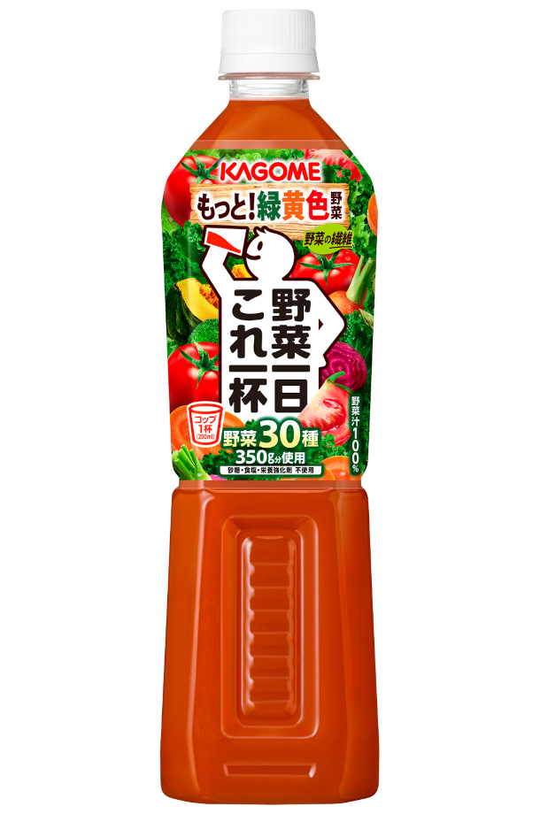
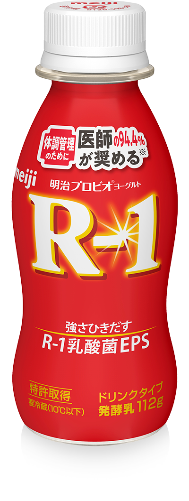
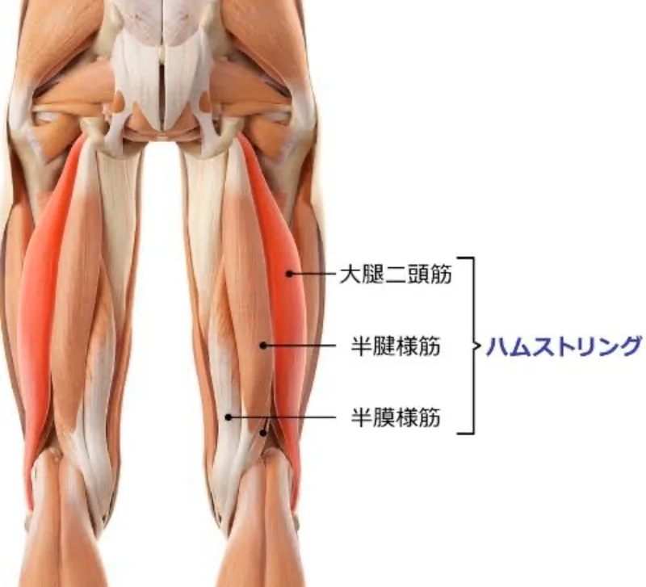
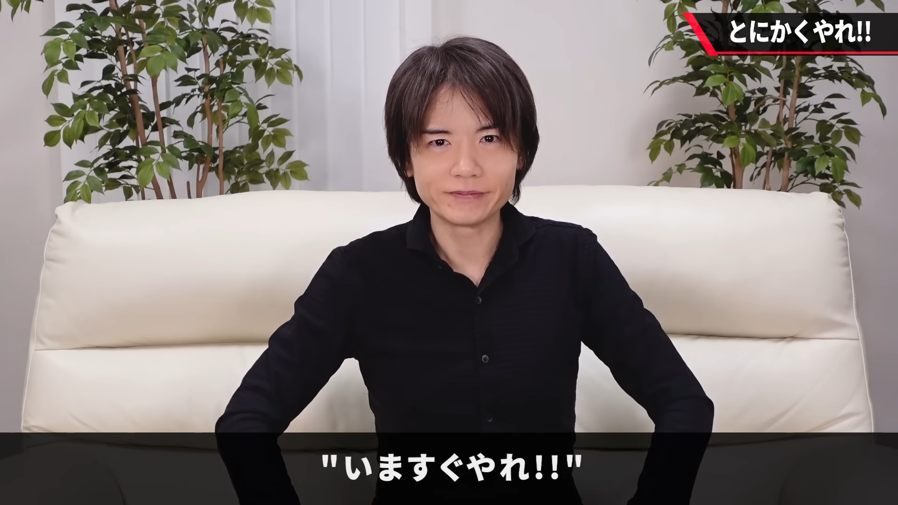

<!-- _class: lead -->
<!-- _header: "" -->

# なんだかんだ続いている習慣

---

## 野菜ジュースを毎朝飲む

- 202509 ～
- 人参をあまり買わないので補完できる
- 別に身体にいいわけではない
- 美味しい

---

## Y1000/R-1を毎晩飲む

- Y1000
  - 202510 ～ 202603
  - 正直、睡眠の質は上がったのかわからない
  - ちゃんとしたマットレスで寝るほうが効果あると思う
  - 美味しい
- R-1
  - 202604 ～
  - まだ効果は実感できてない
  - 美味しい

---

## お風呂上がりのストレッチ（ほぼ脚）

- 202601 ～
- 腿裏が死ぬほど固くなって危機感
- 多少柔らかくなってきたけど、見違えるほどではない

---

## 帰宅後、すぐにお風呂に入る

- 202603 ～
- めちゃくちゃいい習慣
- 帰ってから椅子に座らないのが重要
- 平日の晩御飯から寝るまでの時間が長く感じられる
  - 体感だと倍長くなっている気がする

---

## 習慣化について思ったこと

- 雑でもいいからやる
  - 効率は一旦無視
- めんどくさくないレベルで始める

--- 

### おすすめの習慣あったら教えてください
