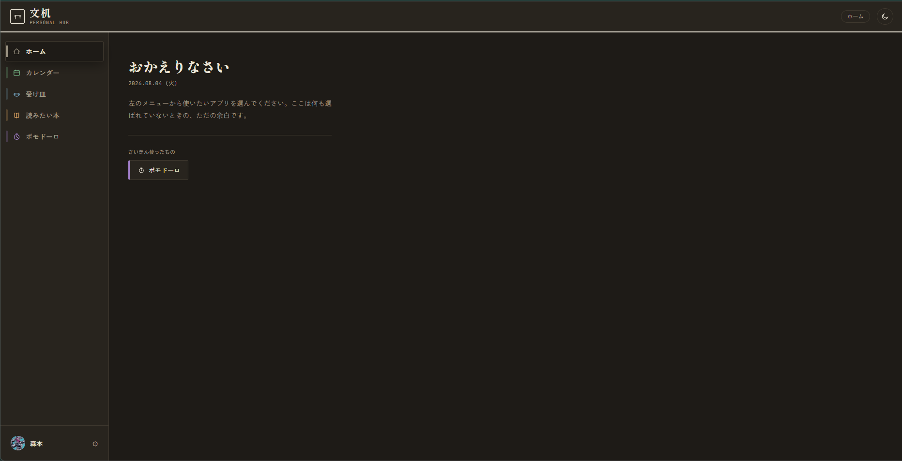
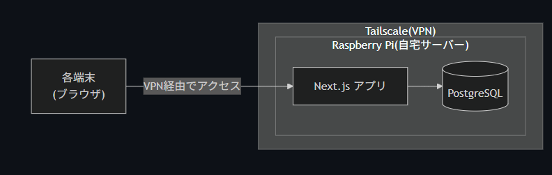
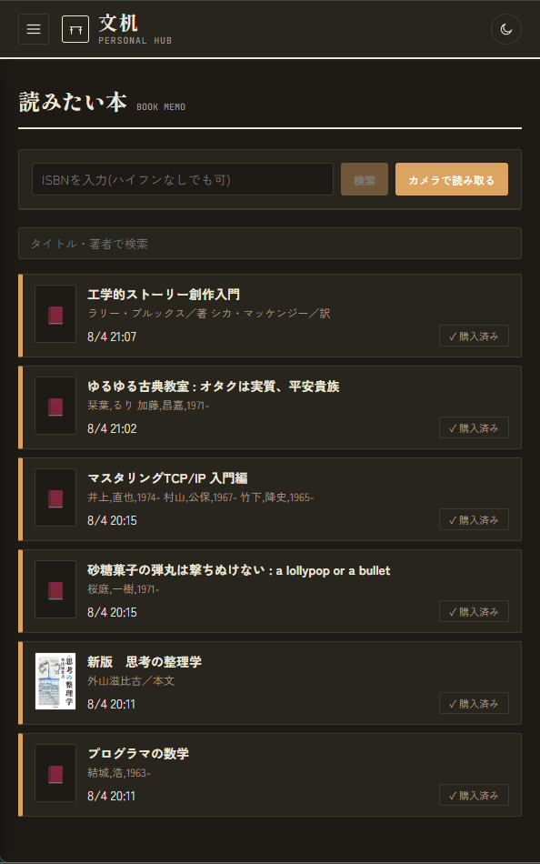
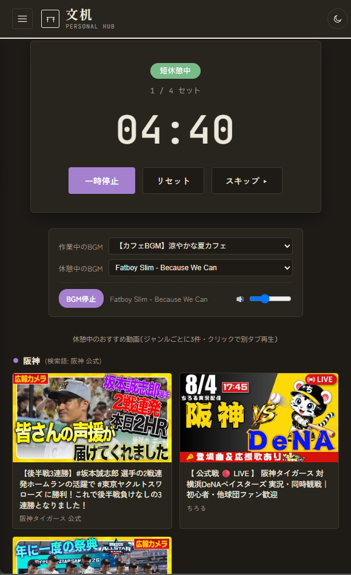
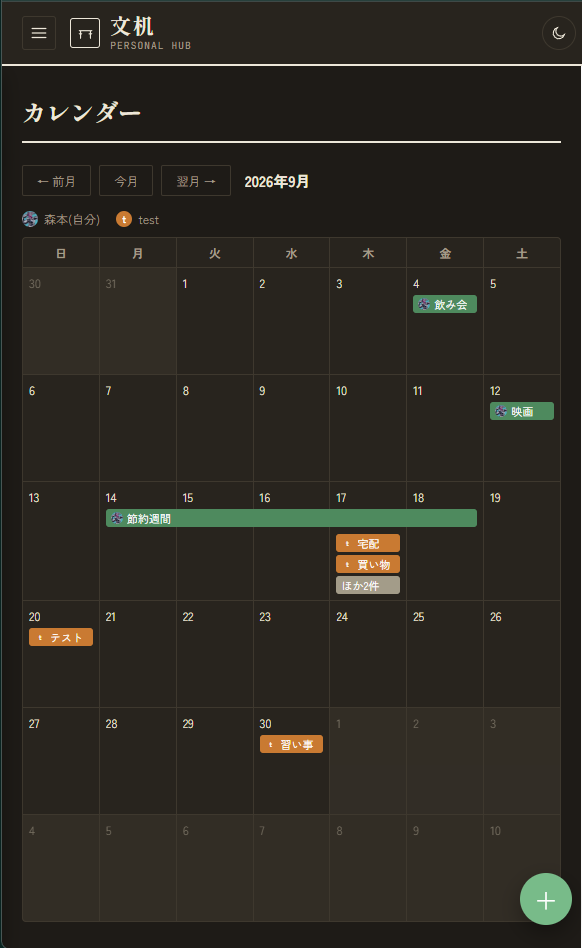
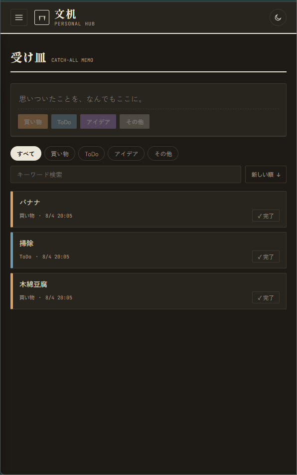

<!-- _class: lead -->
<!-- _header: "" -->

# Claudeで個人用アプリを作った

---

## こんな感じ

---

## 構成

- (使っているAPIなどは省略)

---

## 読みたい本

- ISBNからAPIを使って書籍情報をメモする
- PCで登録して本屋に行く。スマホでメモを確認できる
- 本屋で予算オーバーしたらその場でバーコードを読み取ってメモ

---

## ポモドーロ

- 25分作業、5分休憩（時間は自由に変更できる）
- 作業中のBGMと休憩中のBGMを設定できる（youtube API）
- 休憩中に見る動画も表示（youtube API）

---

## 1機能当たり4hくらい

- 仕様書とテスト作成もやらせた
- Claude触り始めにしてはいい感じ
- 休み中にClaudeのドキュメント読んで、もっと使いこなせるようにする

--- 

## カレンダー

- Googleアカウントでログインするので、カレンダーを同期して表示。編集も可
- 登録ユーザ全員の予定を統合して表示

---

## 受け皿

- 汎用メモ
  - 内容書いてジャンルを選ぶだけ
