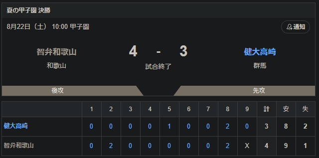
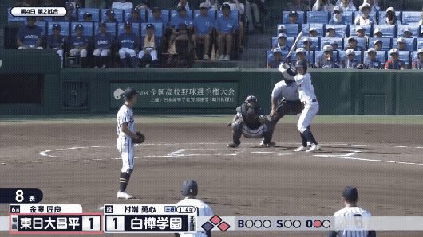

<!-- _class: lead -->
<!-- _header: "" -->

# 第108回全国高等学校野球選手権大会

---

## 優勝

- 智辯和歌山
  - 逆転された後の8回裏で再逆転
  - 5年ぶり4回目の優勝

- 健大高崎は勝てば、夏は初優勝だった😢

---

## そのほかの話題

- 横浜高校 織田君が甲子園最速を更新 156km
- 熊本県代表 有明高校 初出場でベスト8
  - 初出場で初優勝だったら2013年以来だった😢

---

## 今大会ベストプレー

- 北北海道 白樺学園 
  - 引用 https://www.youtube.com/watch?v=X0cJPR-3-cU

---

## 応援に着目しても面白いよ①

- プロ野球のチャンステーマ・選手応援歌が流れる
  - 阪神・ロッテが特に人気
  - 阪神タイガース
    - チャンス襲来
    - T-WAVE
  - 千葉ロッテマリーンズ
    - チャンステーマ3
      - （原曲 パチスロ モンキーターン）
    - 藤原恭大 応援歌
      - （原曲 パワポケ13 逆襲の時）

---

## 応援に着目しても面白いよ②

- オリジナルチャンステーマがある高校がある（下記は一部）
  - 智辯和歌山
    - ジョックロック
      - （原曲 ヤマハサンプル音源のアレンジ曲）
  - 佐野日大
    - マグナ
      - （イントロだけバックトゥザフューチャーのメインテーマ）
  - 札幌日大
    - Nichidai Pride
      - 今年知った。完全オリジナルだけどめちゃくちゃかっこいい

---

## まとめ

- そろそろ公立の優勝校が見たい！
  - 前回の公立優勝校は2007年佐賀北
- 来年もどんな流行りの曲が流れるか楽しみ
