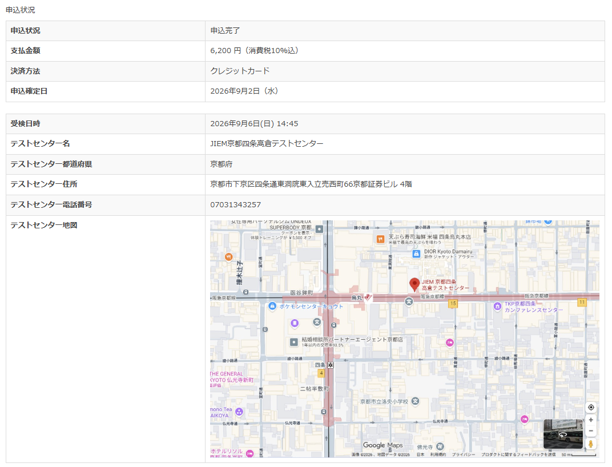
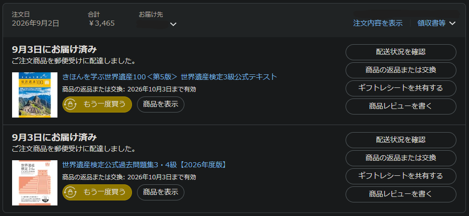
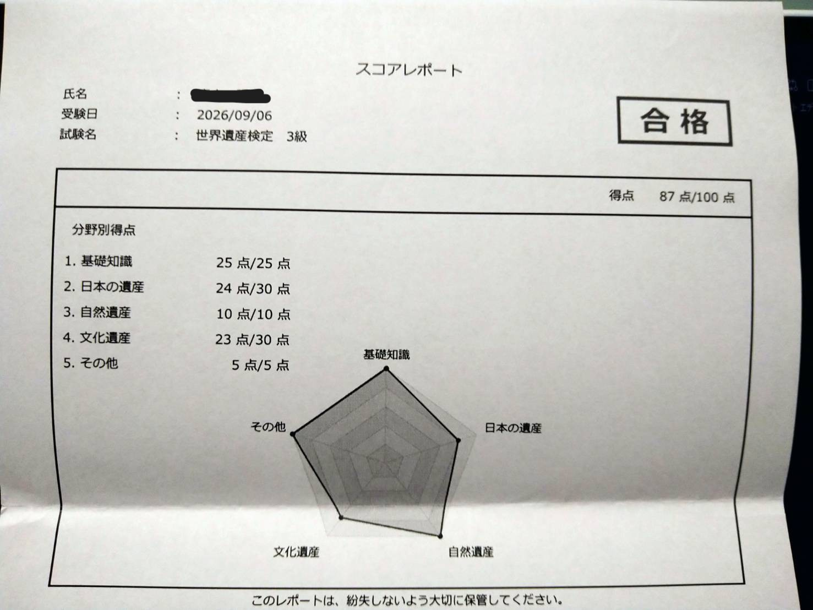
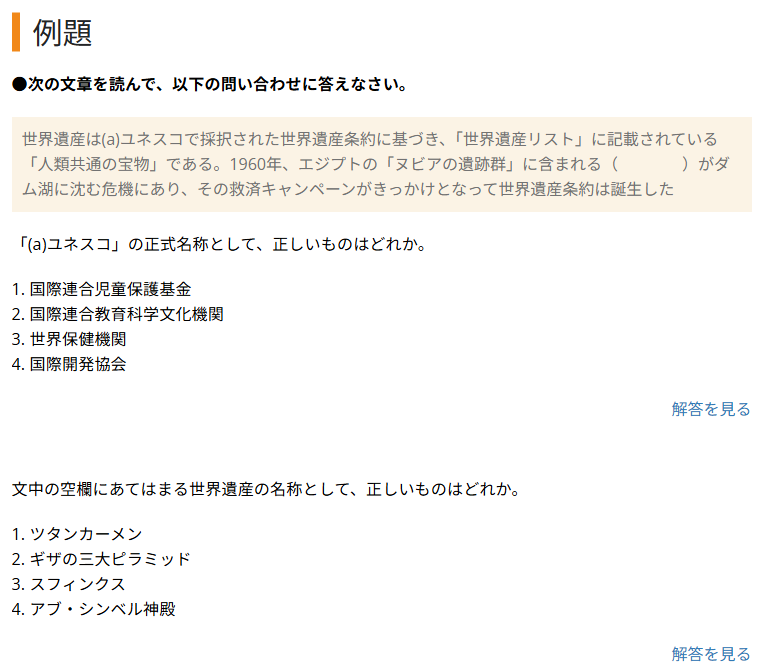
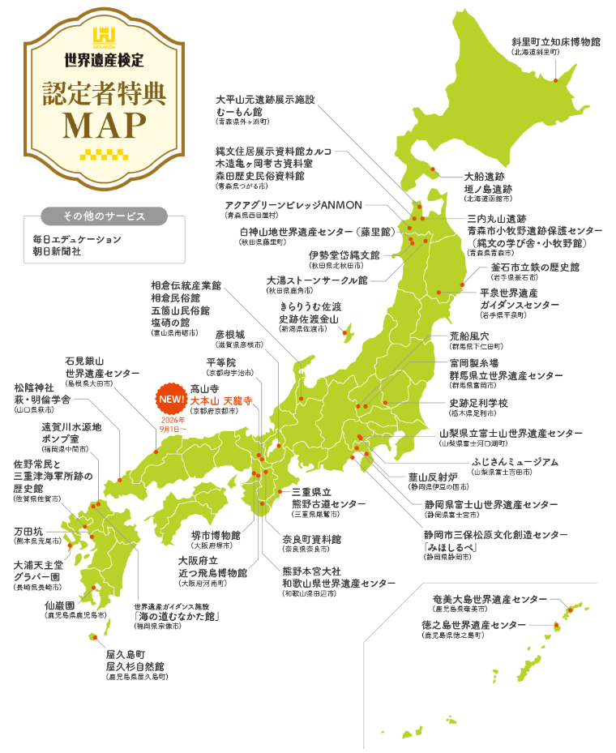

<!-- _class: lead -->
<!-- _header: "" -->

# 世界遺産検定を受けてみた

---

## 世界遺産検定とは

- 人類共通の財産・宝物である世界遺産を通して、国際的な教養を身に付け、持続可能な社会の発展に寄与する人材の育成を目指した検定
  - （公式サイトより）

⇒ 世界遺産についての知識を問われる検定

---

## 受けたのは3級

---

## 学習時間と教材

- 勉強時間
  - 14.5h (8hあれば受かると思う)  
- 勉強に使ったもの

---

## 結果

- 87点 （合格点は60点）

---

## 試験内容について

- テキストで強調されてる単語さえ分かれば合格できる
  - 100点取ろうと思うと公式テキストを丸暗記する必要がある

---

## まとめ

- もう少し早く着手して2級受ければよかった……。
- 旅行好きな人、歴史・地理が好きな人はおすすめ
- 日本の世界遺産に関係する施設で特典がもらえる
  - 割引されたり、物がもらえたりする

